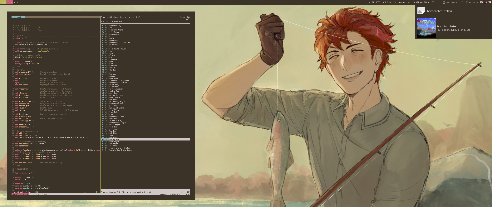

# dotfiles NEO
<!--
%

Finally got around to organising my dotfiles. This system uses
[stow](http://www.gnu.org/software/stow/) to organise everything, as detailed
in [this article](https://brandon.invergo.net/news/2012-05-26-using-gnu-stow-to-manage-your-dotfiles.html).

I found out about this method of dotfile management thanks to the awesome
[pyratebeard](https://pyratebeard.net),
so special thanks to him.
-->

## Installation
To install the dotfiles:
```
git clone https://github.com/beanrob/dots-NEO ~/dots
cd dots

# Now install each module with stow
# Install vim module:
stow vim
stow misc
...
# Install vim plugins:
vim +PluginInstall +qall
# Uninstall vim module:
stow -D vim
```

## Modules & Packages

### Single Package Modules
- alacritty
- fish
- vim

### Multi Package Modules
- i3
    - i3wm
    - i3bar
    - i3status
- mpd
    - mpd
    - ncmpcpp
    - mpDris2
- misc
    - neofetch
    - picom
    - redshift
    - pywal
    - dunst

### Standalone Modules
- bin
